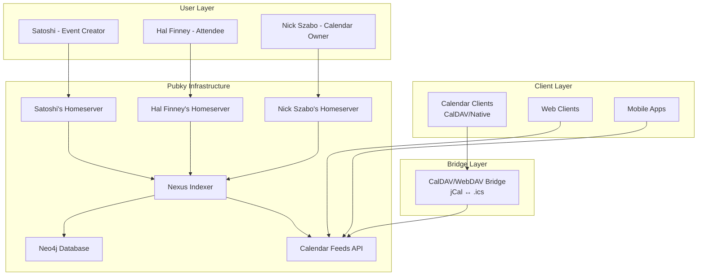
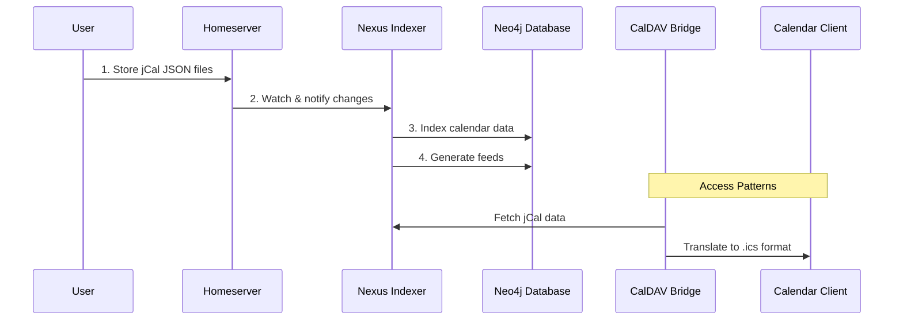

## Architecture Overview

### System Overview



### Data Flow for a CalDAV Bridge

```
Note:
Below Diagram is an example outlining the flow for a potential CalDAV client. I currently
don't have a plan to implement this during the prototyping phase. The idea is
that this could be created at a later stage based on the curent core
specification.
```



1. **Storage**: Users store PubkyAppVCalendar, PubkyAppVEvent,
   PubkyAppVAttendee, PubkyAppVAlarm, ... files as jCal files on their
   homeservers at `/pub/pubky.app/...`
2. **Indexing**: Nexus watches homeserver paths, indexes calendar data into
   Neo4j graph database
3. **Aggregation**: Nexus generates feeds based on follows, tags, date ranges,
   and social signals, ... (Exact endpoints TBD)
4. **Access**: Clients query Nexus REST API for aggregated feeds.
5. **Bridging**: CalDAV bridge translates between jCal JSON and .ics format for
   legacy client compatibility and maps iTip functionality to Pubky Homeserver
   Documents.

---
