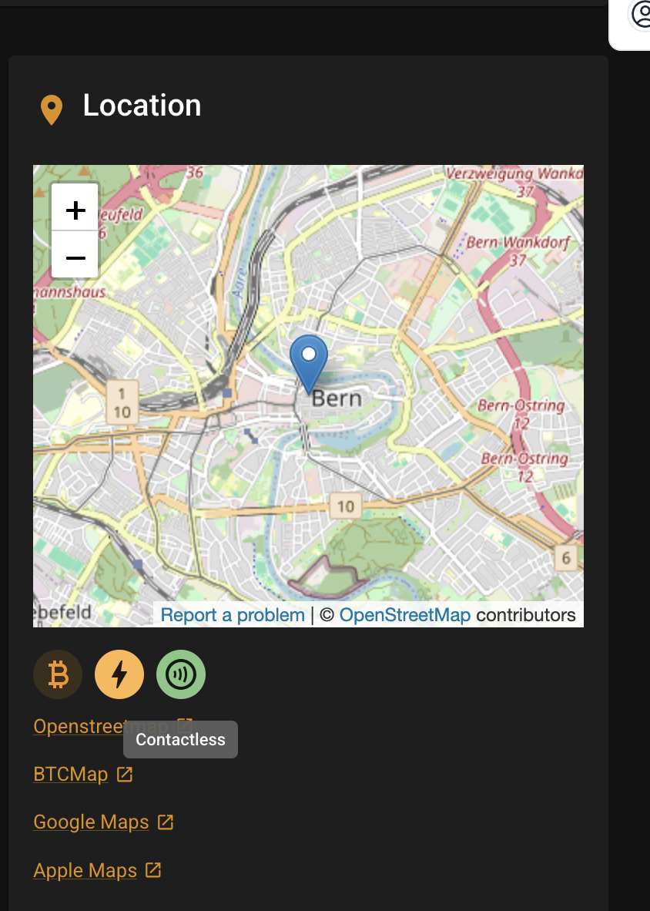

# Prototype Implementation

## Executive Summary

The Goal is to implement a first Proof of Concept application based on the
outlined specification. The main objective is to implement the minimal Nexus
Endpoints and have a frontend application display the aggregated feeds to be
able to create public Events like Bitcoin Meetups using the "iCal on Pubky"
standard.

This should serve as a base to extend Events/Calendars to implement more
functionalities at a later stage. This can include but is not limited to a
CalDAV bridge, implement shareable encrypted private Calendars/Events, support
for _all_ RFC extensions, extend Events to have multiple admins, ...

## Notes

- Feature set taken from iCal standards is defined in other documents with exact
  details possibly slightly changing throughout prototype development.

## Architecture Overview

```mermaid
graph TB
    subgraph "User Layer"
        U1[Event Creator]
        U2[Event Attendee]
        U3[Calendar Admin]
    end

    subgraph "Client Application - Next.js"
        subgraph "Authentication"
            AUTH["@synonymdev/pubky SDK"]
            QR[QR Code Login]
            RING[Pubky Ring Integration]
        end
        
        subgraph "Discovery Pages"
            ED["Event Discovery Page\nList/Calendar Views"]
            CD["Calendar Discovery Page\nList View"]
            FILTER["Filter Components\nTags/Location/Date"]
        end
        
        subgraph "Overview Pages"
            EO["Event Overview Page\nDetails/Map/Comments"]
            CO["Calendar Overview Page\nList/Calendar Views"]
        end
        
        subgraph "Creation & Edit"
            ECM["Event Creation Modal\nForm + Image Upload"]
            CCM["Calendar Creation Modal\nForm + Image Upload"]
        end
        
        subgraph "UI Components - Tailwind CSS"
            HEADER[Calendar/Event Header]
            ELIST[Event List Cards]
            ECAL[Event Calendar View]
            LOC[Location Display]
            OSM[OSM Map Integration]
            TAGS[Pubky Tags]
            ATT[Attendees Component]
        end
        
        API[Nexus API Client]
    end

    subgraph "Pubky Infrastructure"
        subgraph "Extended Nexus Indexer"
            NI[pubky-nexus<br/>Calendar Extensions]
            
            subgraph "New Calendar Endpoints"
                EP1[GET /calendars]
                EP2[GET /calendars/:id]
                EP3[GET /events]
                EP4[GET /events/:id]
                EP5[GET /calendars/:id/events]
                EP6[GET /attendees]
            end
            
            DB[(Neo4j Database)]
        end
        
        subgraph "Homeservers"
            HS1[User 1 Homeserver<br/>pubky://user1z123...]
            HS2[User 2 Homeserver<br/>pubky://user2x456...]
            HS3[User 3 Homeserver<br/>pubky://user3y789...]
        end
        
        subgraph "Storage Structure"
            CAL[/pub/pubky.app/calendars/]
            EVT[/pub/pubky.app/events/]
            ATD[/pub/pubky.app/attendees/]
            FILES[/pub/pubky.app/files/]
        end
    end

    subgraph "External Services"
        OSMAPI[Nominatim OSM API<br/>Location Geocoding]
    end

    %% User Authentication Flow
    U1 --> QR
    U2 --> QR
    U3 --> QR
    QR --> AUTH
    AUTH --> RING
    
    %% Discovery Flow
    U1 --> ED
    U1 --> CD
    U2 --> ED
    U3 --> CD
    ED --> FILTER
    CD --> FILTER
    
    %% Overview Flow
    ED --> EO
    CD --> CO
    
    %% Creation Flow
    U1 --> ECM
    U3 --> CCM
    ECM --> AUTH
    CCM --> AUTH
    
    %% Component Usage
    ED --> ELIST
    ED --> ECAL
    EO --> HEADER
    EO --> LOC
    EO --> OSM
    EO --> TAGS
    EO --> ATT
    CO --> HEADER
    CO --> ELIST
    CO --> ECAL
    
    %% API Communication
    API --> EP1
    API --> EP2
    API --> EP3
    API --> EP4
    API --> EP5
    API --> EP6
    
    ED --> API
    CD --> API
    EO --> API
    CO --> API
    FILTER --> API
    
    %% Nexus to Homeservers
    NI -.Indexes.-> HS1
    NI -.Indexes.-> HS2
    NI -.Indexes.-> HS3
    
    %% Nexus Internal
    EP1 --> DB
    EP2 --> DB
    EP3 --> DB
    EP4 --> DB
    EP5 --> DB
    EP6 --> DB
    
    %% Homeserver Storage
    HS1 --> CAL
    HS1 --> EVT
    HS1 --> ATD
    HS1 --> FILES
    HS2 --> CAL
    HS2 --> EVT
    HS2 --> ATD
    HS3 --> CAL
    HS3 --> EVT
    
    %% Write Operations
    AUTH -.Writes jCal JSON.-> HS1
    AUTH -.Writes jCal JSON.-> HS2
    AUTH -.Writes jCal JSON.-> HS3
    
    %% External Services
    OSM --> OSMAPI
    
    classDef userClass fill:#e1f5ff,stroke:#0066cc,stroke-width:2px
    classDef clientClass fill:#fff4e6,stroke:#ff9800,stroke-width:2px
    classDef nexusClass fill:#f3e5f5,stroke:#9c27b0,stroke-width:2px
    classDef storageClass fill:#e8f5e9,stroke:#4caf50,stroke-width:2px
    classDef externalClass fill:#fce4ec,stroke:#e91e63,stroke-width:2px
    
    class U1,U2,U3 userClass
    class AUTH,QR,RING,ED,CD,EO,CO,ECM,CCM,API,HEADER,ELIST,ECAL,LOC,OSM,TAGS,ATT,FILTER clientClass
    class NI,EP1,EP2,EP3,EP4,EP5,EP6,DB nexusClass
    class HS1,HS2,HS3,CAL,EVT,ATD,FILES storageClass
    class OSMAPI externalClass
```



## Technology Stack

- Next.js
- Tailwind CSS
- TODO: How to call Nexus Ednpoints?

## Core Features

### Discovery Pages

Both the Event and Calendar Discovery pages will have a similar layout, sharing
dynamically adjusted components between each other. At the top of the page will
be a filter/search card where users can limit the output of Events/Calendars
being displayed by Tags, Title, Location and such.

#### Event Discovery

The Events Discovery page will have 2 different views. Either card-based where
the Image (Calendar-Color if none is set) is shown on top with the Metadata
being displayed below.

Or a Calendar-View where based on Calendar colors Events are being displayed.

Similar to how Meetup.com does it on community-pages:


- Recurring Events are rendered for each date inside of the list and calendar
  views. With overrides being specific.

##### Filter Card Options

| Filter              | Description                                                                 |
| ------------------- | --------------------------------------------------------------------------- |
| Text-Search         | Search through all metadata                                                 |
| Structured Location | Allow limiting to a Radius or Exact Cities based on Structure location tags |
| Pubky Tags          | Limit to PubkyAppTags that users assigned to Event                          |
| Date Range          | Limit to events between a certain date range. Have a default set from today |
| ...                 | Extend based on needs                                                       |

#### Calendar Discovery

Calendar Discovery will only have a List output and will be focused on finding
different Calendars.

##### Filter Card Options

| Filter          | Description                                             |
| --------------- | ------------------------------------------------------- |
| Text-Search     | Search through all metadata                             |
| Pubky Tags      | Limit to PubkyAppTags that users assigned to Event      |
| Upcoming Events | Only show Calendars with upcoming Events. Default: True |
| ...             | Extend based on needs                                   |

### Overview Pages

Overview Pages will follow a Card-Based components approach. This allows to
easily extend more fields into the standard and easily dinamically render
optional fields.

If the creator of Calendar/Event is looking at one of their own Documents there
will be an edit-button in top right. This will open the same modal (pre-filled)
as when creating a new Calendar/Event.

#### Calendar Overview:

Have a list/calendar view. Similar to how meetup.com does it (Reuse same
components as in Event Overview but only outputting events of single Calendars):

- Recurring Events are rendered for each date inside of the list.
- Calendar Metadata is displayed at the top

#### Event Overview:

- Page to view a single Event
- Location OSM Map integration => linking to Apple Maps, Google Maps, OSM
  - Show Bitcoin Payment tags
  - Example here:
    https://meetstr.com/event/naddr1qvzqqqrukvpzpzd4ye7z7x886as20jpf8xw46rdfywmg04f75f4xl566wu8entspqqy9yj63xyekx3ryaylwxs

    
- Comments, Tags using PubkyAppPost and PubkyAppTags

### Lower priority features

Once above Features are implemented extending the Client with following would
make sense:

- Overview Page for own Calendars/Events
- Page showing own Attendance and history
- Implement VAlarm functionalities for notifications per-user.
  (Android/iOS/Browser Push notifications, Email notifications, Messenger-Alarm,
  ...)

### Event/Calendar creation Modals

To create a new Event or Calendar users should be able to open a Modal. The same
Modals will be used when editing an Event. The Form will include Fields to
create all the required Metadata outlined inside of the seperately documented
specification for VCalendar and VEvent as well as an Image upload creating a
PubkyAppFile. Similar approach to how it is done in meetstr at the moment.

### Main Components

```
Note: Will be extended further and divided into sub-components during Development.
```

| Name                     | Description                                                                                                                                                                                             |
| ------------------------ | ------------------------------------------------------------------------------------------------------------------------------------------------------------------------------------------------------- |
| Calendar/Event Header    | Header for a Calendar with Image, Summary, Host, Admins, Categories ... - Subcomponents are dinamically rendered based on if it's a calendar/event and what Metadata is present                         |
| Event List               | Card based list to display Events. (Supports single calendar or multiple as input). Clicking on an Event will open the Event detail page                                                                |
| Event Calendar           | Calendar-Style display of Events. (Supports single calendar or multiple as input). Clicking on an Event will open the Event detail page                                                                 |
| Location display         | Card displaying a text-based location                                                                                                                                                                   |
| OSM Location display     | Card displaying a structured location using OSM (Nominatim API) - Displays payment possibility in Bitcoin                                                                                               |
| iCal Metadata components | Simple Card Components for other Metadata optionalities in iCal format                                                                                                                                  |
| Pubky Tags               | Show Tags like Pubky.app                                                                                                                                                                                |
| Attendees                | Component rendering attendees of an Event with their respective status => Invitng attendees to an Event will not be implemented yet in Event creation. Could be added with exisitng tags in the future. |
| Event Creation Modal     | Form to create a new Event with Image Upload and Metadata input                                                                                                                                         |
| Calendar Creation Modal  | Form to create a new Calendar with Image Upload and Metadata input                                                                                                                                      |
