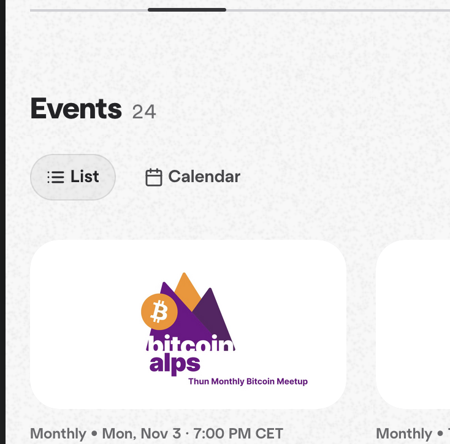

# Prototype Implementation

## Executive Summary

The goal is to implement a first proof-of-concept application based on the
outlined specification. The main objective is to implement the minimal Nexus
endpoints and have a frontend application display the aggregated feeds to enable
the creation of public events like Bitcoin Meetups using the "iCal on Pubky"
standard.

This should serve as a base to extend events/calendars and implement more
functionality at a later stage. This can include, but is not limited to, a
CalDAV bridge, shareable encrypted private calendars/events, support for _all_
RFC extensions, extending events to have multiple admins, etc.

## Notes

- The feature set taken from iCal standards is defined in other documents, with
  exact details possibly changing slightly throughout prototype development.
- A diagram outlining the prototype architecture is present in
  [diagrams.md](./diagrams.md#full-prototype-architecture-overview)

## Technology Stack

- Node.js
- Next.js
- Tailwind CSS
- ShadCN UI component library (analog Franky)
- Zustand for state management (I have never used Zustand personally, but since
  I know you use it, it likely makes sense to use it as well and get familiar
  with it)
- Axios
- Nominatim for OSM integration

## Roadmap (High Level)

### Research and Feature Mapping (1-2 weeks) - Done

- Get familiar with existing Pubky Apps
- Research and document existing iCalendar standards
- Scope prototype
- Define minimal Nexus endpoints
- Define new homeserver documents and structure

### Integrate Basic Nexus Endpoints (~3 weeks)

- Set up local environment (set up Nexus locally, local homeserver with example
  documents to test indexing in development, etc.)
- Get familiar with existing architecture
- Add new Pubky app types
- Set up indexing analogous to other types
- JCal parsing logic
- Testing of endpoints
- Endpoint filters using PubkyAppTags

```
Note: Personal unfamiliarity with Rust and Nexus makes it hard to know how realistic this scope is. It could potentially be shorter, but making sure the integration is robust is a priority for me.
```

### Calky PWA (~2 weeks)

- Set up new project with outlined scope

### Cleanup and More Complex Indexing (~1 week)

- Integrate OSM-tag-based indexing in Nexus for events
- Clean up project and update this documentation for handoff

### Implement Frontend Application

## Core Features

### Discovery Pages

Both the event and calendar discovery pages will have a similar layout, sharing
dynamically adjusted components. At the top of the page will be a filter/search
card where users can limit the output of events/calendars being displayed by
tags, title, location, and so on.

#### Event Discovery

The events discovery page will have two different views: either card-based,
where the image (calendar color if none is set) is shown on top with the
metadata displayed below, or a calendar view, where events are displayed based
on calendar colors.

Similar to how Meetup.com does it on community pages:



- Recurring events are rendered for each date inside the list and calendar
  views, with overrides being specific.

##### Filter Card Options

| Filter              | Description                                                         |
| ------------------- | ------------------------------------------------------------------- |
| Text Search         | Search through all metadata                                         |
| Structured Location | Limit to a radius or exact cities based on structured location tags |
| Pubky Tags          | Limit to PubkyAppTags that users assigned to events                 |
| Date Range          | Limit to events between certain dates. Default is set from today    |
| ...                 | Extend based on needs                                               |

#### Calendar Discovery

Calendar discovery will only have a list output and will be focused on finding
different calendars.

##### Filter Card Options

| Filter          | Description                                             |
| --------------- | ------------------------------------------------------- |
| Text Search     | Search through all metadata                             |
| Pubky Tags      | Limit to PubkyAppTags that users assigned to events     |
| Upcoming Events | Only show calendars with upcoming events. Default: True |
| ...             | Extend based on needs                                   |

### Overview Pages

Overview pages will follow a card-based component approach. This allows easy
extension of more fields into the standard and enables dynamic rendering of
optional fields.

If the creator of a calendar/event is viewing one of their own documents, there
will be an edit button in the top right. This will open the same modal
(pre-filled) as when creating a new calendar/event.

#### Calendar Overview

Have a list/calendar view, similar to how Meetup.com does it (reuse the same
components as in event overview, but only output events of a single calendar):

- Recurring events are rendered for each date inside the list.
- Calendar metadata is displayed at the top.

#### Event Overview

- Page to view a single event
- Location OSM map integration, linking to Apple Maps, Google Maps, OSM
  - Show Bitcoin payment tags
  - Example here:
    https://meetstr.com/event/naddr1qvzqqqrukvpzpzd4ye7z7x886as20jpf8xw46rdfywmg04f75f4xl566wu8entspqqy9yj63xyekx3ryaylwxs

    
- Comments, tags using PubkyAppPost and PubkyAppTags

### Lower Priority Features

Once the above features are implemented, extending the client with the following
would make sense:

- Overview page for own calendars/events
- Page showing own attendance and history
- Implement VAlarm functionalities for notifications per user
  (Android/iOS/browser push notifications, email notifications, messenger alarm,
  etc.)

### Event/Calendar Creation Modals

To create a new event or calendar, users should be able to open a modal. The
same modals will be used when editing an event. The form will include fields to
create all the required metadata outlined in the separately documented
specification for VCalendar and VEvent, as well as an image upload creating a
PubkyAppFile. This is a similar approach to how it is done in Meetstr at the
moment.

### Main Components

```
Note: Will be extended further and divided into sub-components during development.
```

| Name                     | Description                                                                                                                                                                                            |
| ------------------------ | ------------------------------------------------------------------------------------------------------------------------------------------------------------------------------------------------------ |
| Calendar/Event Header    | Header for a calendar with image, summary, host, admins, categories, etc. Subcomponents are dynamically rendered based on whether it's a calendar/event and what metadata is present                   |
| Event List               | Card-based list to display events (supports single calendar or multiple as input). Clicking on an event will open the event detail page                                                                |
| Event Calendar           | Calendar-style display of events (supports single calendar or multiple as input). Clicking on an event will open the event detail page                                                                 |
| Location Display         | Card displaying a text-based location                                                                                                                                                                  |
| OSM Location Display     | Card displaying a structured location using OSM (Nominatim API) - displays payment possibility in Bitcoin                                                                                              |
| iCal Metadata Components | Simple card components for other optional metadata in iCal format                                                                                                                                      |
| Pubky Tags               | Show tags like Pubky.app                                                                                                                                                                               |
| Attendees                | Component rendering attendees of an event with their respective status. Inviting attendees to an event will not be implemented yet in event creation. Could be added with existing tags in the future. |
| Event Creation Modal     | Form to create a new event with image upload and metadata input                                                                                                                                        |
| Calendar Creation Modal  | Form to create a new calendar with image upload and metadata input                                                                                                                                     |
